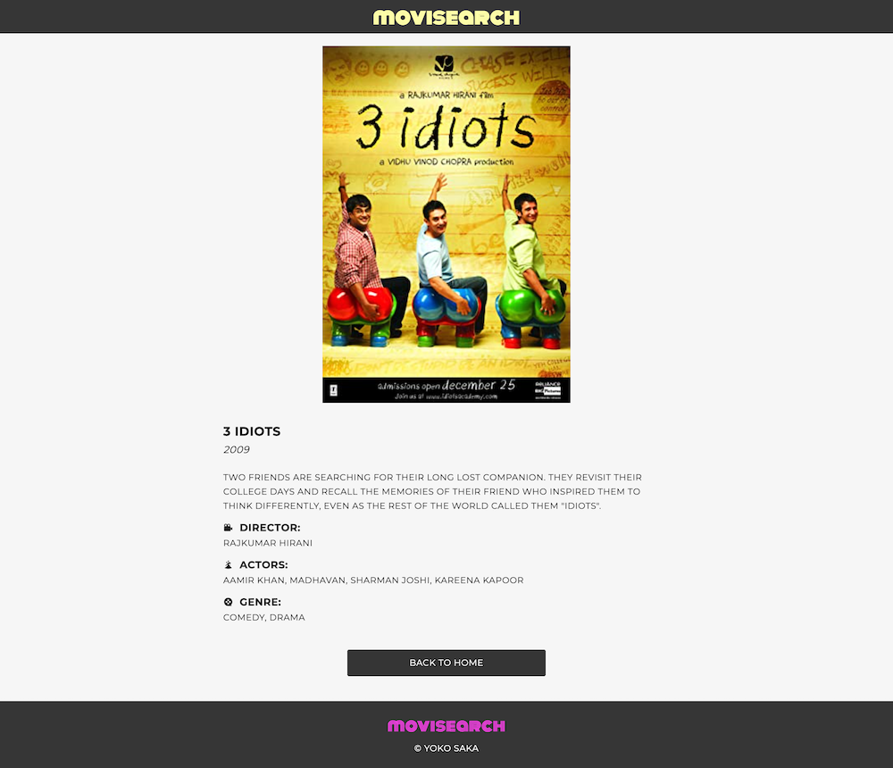

# Catalogue of Movies with React & Redux

**Search Result** 

**Movie Detail** 

## About the Project

This project was built as a React & Redux Capstone project at Microverse.
It is based on the idea of a "Catalogue of Recipes" which is a single-page application with React and Redux.

It shows a browsable list of movies that users can filter and access to the details of each movie. Every page, the main page, and pages for each item have a unique route within the Single Page Application, SPA.

I deployed this app to Heroku, so it’s accessible online.
The data is retrieved from the Open Movie Database, [OMDb API](https://www.omdbapi.com/).
With this API, this app fetches the list data of movies based on the user’s input. 
And the retrieved data is stored in the Redux store.

Also, it retrieves the particular movie data by searching a unique id in the background and update the data in the Redux store only when the unique id matches the data of the store.

This web app has 3 types of pages:

- one page with a list of items that could be filtered by some parameters
In this project, it’s a list of movies that can be filtered by the title and the year of the movie.

- one page for the item details
In this project, it’s the movie detail page.

- one page for not found
If users input the wrong path directly, the app shows the 404 page.

A list of commonly used resources that I find helpful is listed in the acknowledgments.

## Built With

* [React](https://reactjs.org/)
* [Redux](https://redux.js.org/)
* [JavaScript](https://en.wikipedia.org/wiki/JavaScript)
* [HTML5](https://en.wikipedia.org/wiki/HTML5)
* [SASS](https://sass-lang.com/)

## Live Demo

[Live Demo Link](https://catalogue-of-movies-yoko.herokuapp.com/)

## Getting Started

To get a local copy up and running follow these simple example steps.

1. On the project GitHub page, navigate to the main page of the repository.
2. Under the repository name, locate and click on a green button named `Code`. 
3. Copy the project URL as displayed.
4. If you're running the Windows Operating System, open your command prompt. On Linux, Open your terminal. 
5. Change the current working directory to the location where you want the cloned directory to be made. Leave as it is if the current location is where you want the project to be. 
6. Type git clone, and then paste the URL you copied in Step 3.  
e.g. $ git clone https://github.com/yourUsername/yourProjectName 
7. Press Enter. Your local copy will be created. 
8. To run the server in your local environment, run `npm start`
9. To run the tests, run `npm test`

## Author

👤 **Yoko Saka**

- GitHub: [@yocosaka](https://github.com/yocosaka)
- Twitter: [@yocosaka](https://twitter.com/yocosaka)
- LinkedIn: [Yoko Saka](https://www.linkedin.com/in/yokosaka)

## Contributing

Contributions, issues, and feature requests are welcome!
Feel free to check the [issues page](../../issues).

1. Fork the Project
2. Create your Feature Branch (`git checkout -b feature/AmazingFeature`)
3. Commit your Changes (`git commit -m 'Add some AmazingFeature'`)
4. Push to the Branch (`git push origin feature/AmazingFeature`)
5. Open a Pull Request

## Show your support

Give a ⭐️ if you like this project!

## License

This project is [MIT](./LICENSE) licensed.

## Acknowledgements
* [Prop Types](https://www.npmjs.com/package/prop-types)
* [Heroku](https://dashboard.heroku.com/)
* [iconify](https://iconify.design/icon-sets/)
* [Pixabay](https://pixabay.com/)
* [OMDb API](https://www.omdbapi.com/)
